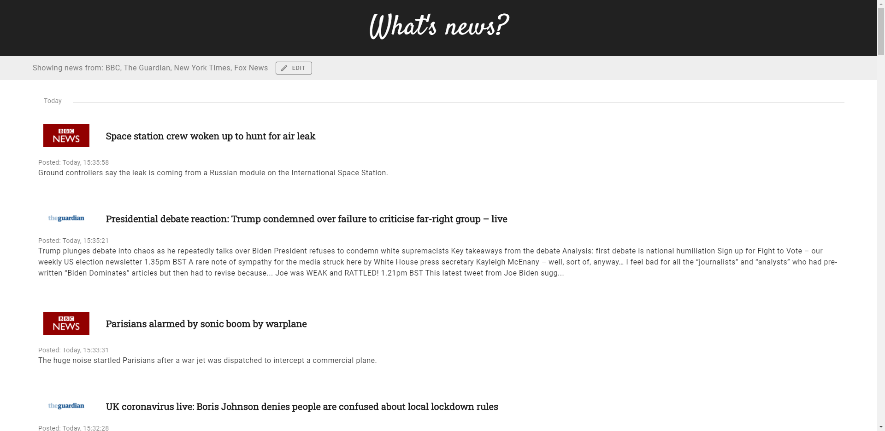

# News Aggregator
A website that aggregates news from news sites rss. A user can select his favorite news websites, and the site will aggregate the news from them .

URL: *https://slavasimonov.github.io/NewsAggregator/*

## Presentation

The site is written using [Vue.js](https://vuejs.org/). For the design I have used [Vuetify](https://vuetifyjs.com/en/).

I parse RSS feeds using [rss-parser](https://github.com/rbren/rss-parser#readme).

## Features
- Default list of news sites to choose from is provided.
- It is possible to add more websites, if your favorite one is not on the list.
- Your list of feeds will be stored in the browser. That means, that you need to set up your favorite websites only once.
- News are sorted by date, so newer articles will be on the top of the page.

## Contact
*simonowslawa@gmail.com*
